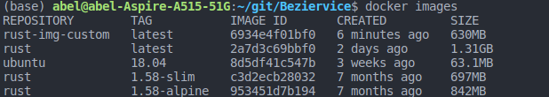

# Beziervice

__Service of Bézier's curves and surfaces__

Proyecto dedicado a la construcción de curvas de Bezier en rust de forma rápida, eficaz y reutilizable.

En estos momentos el proyecto se encuentra en la fase de construcción de un entorno de test basado en docker y alojado en Dockerhub y Github Container Registry.

## Justificación de la imagen elegida como base

Existen varias imágenes oficiales de rust para la imagen del contenedor de test, en las cuales es posible elegir la versión de rust. La diferencia entre las imágenes es el tamaño, dado por los paquetes y dependencias que se encuentran en cada imagen y también por la imagen base del sistema operativo.

En estos momentos para los binarios de ejecución se suelen crear imágenes en varios __stage__, donde se toma una imagen base oficial del lenguaje y se compila el programa en ella para luego crear una imagen más pequeña a partir de alguna distribución de tamaño reducido en la que se copia solo el binario generado por la imagen grande. A esto se le suele conocer como build "from scratch". Sin embargo se ha decidido en lugar de crear una imagen propia personalizada intentando logar un resultado de una imagen de tamaño mínimo, dado que el objetivo de este paso del proyecto es familiarizarse con docker y dado que en el comando que se empleará en los tests de entrega se realiza un enlace de los archivos del repositorio con la imagen, he decidido que sería mejor crear una imagen desde 0 en la que se utilice el gestor de tareas y los archivos del proyecto, mejor que una imagen que simplemente contendrá un binario ejecutable y make simplemente lo ejecute.

La imagen base propia presenta el siguiente código:
```Dockerfile
 
FROM ubuntu:18.04

ENV RUSTUP_HOME=/usr/local/rustup \
    CARGO_HOME=/usr/local/cargo \
    PATH=/usr/local/cargo/bin:$PATH \
    RUST_VERSION=1.58.0

RUN apt-get update; \
    apt-get install -y --no-install-recommends \
    ca-certificates \
    gcc \
    libc6-dev \
    wget \
    make \
    ; \
    wget "https://static.rust-lang.org/rustup/archive/1.22.1/x86_64-unknown-linux-gnu/rustup-init"; \
    chmod +x rustup-init; \
    ./rustup-init -y --no-modify-path --profile minimal --default-toolchain $RUST_VERSION --default-host x86_64-unknown-linux-gnu; \
    useradd  berziervice; 
WORKDIR /app/test
CMD chown -R berziervice /app/test && su berziervice -c " PATH=/usr/local/cargo/bin:$PATH make test"
```
En la imagen se pueden ver los tamaños de las imágenes oficiales de rust y de la imagen creada.



En el código se toma un sistema operativo base, se crean las variables de entorno necesarias para rustup y cargo, se instala rustup y finalmente se crea el directorio de trabajo y se da un comando a ejecutar cuando el contenedor se ejecute. Esta imagen generada es, por poco, menor que las imágenes oficiales de rust, por lo que el objetivo ha sido conseguido. Se dispone de una imagen personalizada de Docker para nuestro contenedor de pruebas, con un tamaño mínimo.


## Dockerhub y actualización automática del contenedor

El primer paso sería crear una cuenta personal en [Dockerhub](https://hub.docker.com/), una vez hecho esto es necesario crear un repositorio, tener un token personal y hacer log in. La documentación de la web es sencilla y completa, indicando incluso los comandos que es necesario copiar para iniciar tu primer repositorio.

Una vez hecho esto, se crea una imagen, con nombre ```<hub-user>/<repo-name>```, con el comando ```docker build -t <hub-user>/<repo-name>[:<tag>]``` y se puede subir como primera vez de forma manual empleando el comando ```docker push <hub-user>/<repo-name>:<tag>```.

Se quiere lograr construir la imagen y subirla a dockerhub cada vez que se haga un commit sobre la rama main, para ello se realizan las siguientes tareas:

1. Comprobar el estado del repositorio
2. Login en dockerhub
3. Construir y subir el contenedor a DockerHub

Para eso se va a seguir la documentación oficial que se encuentra [aquí](https://docs.docker.com/ci-cd/github-actions/#set-up-a-docker-project). Como primer paso se crean los secrets de github con un access token y el username de Dockerhub. Es sencillo en **Settings -> Secrets -> New Repository Secret**, el resultado se puede ver en la imagen. El token solo aparecerá una vez, por lo que es importante hacer login en la CLI de docker si se desea o guardarlo directamente en los secrets de github.


El siguiente paso es hacer que el workflow se active cuando sucede un push a la rama main, después crear un trabajo que checkee el repositorio, haga login en Docker Hub y realice la actualización automática. A continuación se ha creado un workflow con el objetivo de cumplir las tareas previamente descritas:

```

name: Dockerhub abeljosesanchez

# Controla cuando va a ejecutarse el workflow
on:
  # Trigger en push a la rama main
  push:
    branches: [ main ]

# Trabajos del workflow
jobs:
  # Un solo trabajo llamado docker
  docker:
    
    runs-on: ubuntu-latest

    # Pasos del trabajo
    steps:
      # Checkea el repositorio
      - name: checkout repo
      - uses: actions/checkout@v3
      # Login a Docker Hub
      - name: Login to Docker Hub
        uses: docker/login-action@v1
        with:
          username: ${{ secrets.DOCKER_HUB_USERNAME }}
          password: ${{ secrets.BEZIERVICE_ACCESS_TOKEN }}
      #Crea y pushea la imagen al repositorio
      - name: Build and push
        uses: docker/build-push-action@v2
        with:
          context: .
          push: true
          tags: ${{ secrets.DOCKER_HUB_USERNAME }}/beziervice
```

## Github container registry

Dado que GitHub es una herramienta que se ha empleado a lo largo de todo el curso y en la que se confía, es lógico usar GitHub Container Registry que se puede integrar con mucha facilidad.
Para ello ha sido necesario crear un token de acceso personal para github secrets y registrarse con él en docker, esto se ha hecho siguiendo la documentación oficial de github sobre token de acceso personal [(PAT)](https://docs.github.com/es/packages/working-with-a-github-packages-registry/working-with-the-container-registry).

Una vez realizado esto, se ha introducido el token como __github secrets__ de la misma forma que en la sección de [Docker Hub](./dockerhub_config.md). Con esta configuración se ha creado un workflow parecido al workflow anterior, pero con facilidades de variables de entorno debido a estar trabajando con GitHub. La imagen resultante es un paquete del repositorio y se puede ver en la sección __packages__ del repositorio.

Finalmente el workflow resultante es:

```
name: ghcr beziervice

on:
  push:
    branches: ['main']

env:
  REGISTRY: ghcr.io
  IMAGE_NAME: ${{ github.repository }}

jobs:
  build-and-push-image:
    runs-on: ubuntu-latest
    permissions:
      contents: read
      packages: write

    steps:
      - name: Checkout repository
        uses: actions/checkout@v3

      - name: Log in to the Container registry
        uses: docker/login-action@f054a8b539a109f9f41c372932f1ae047eff08c9
        with:
          registry: ${{ env.REGISTRY }}
          username: ${{ github.actor }}
          password: ${{ secrets.GITHUB_TOKEN }}

      - name: Extract metadata (tags, labels) for Docker
        id: meta
        uses: docker/metadata-action@98669ae865ea3cffbcbaa878cf57c20bbf1c6c38
        with:
          images: ${{ env.REGISTRY }}/${{ env.IMAGE_NAME }}

      - name: Build and push Docker image
        uses: docker/build-push-action@ad44023a93711e3deb337508980b4b5e9bcdc5dc
        with:
          context: .
          push: true
          tags: ${{ steps.meta.outputs.tags }}
          labels: ${{ steps.meta.outputs.labels }}
```

## Decripción del problema, objetivos y lógica de negocio

Tanto la descripción del problema, como los objetivos y lógica de negocio pueden ser consultados [aquí](./docs/hito0/objetivo-logica-negocio.md)

### Historias de usuario, planificación y entidades

Tanto las historias de usuario del proyecto, como los issues derivados de las mismas, la planificación del proyecto y sus productos minimamente viables representados como milestones en github y las entidades y objetos-valor se pueden consultar [aquí](./docs/hito1/planificacion-us-entidades.md)

### Herramientas de test elegidas

Para los tests del proyecto se han elegido una biblioteca de aserciones, en este caso ha sido [pretty_assertions](https://github.com/colin-kiegel/rust-pretty-assertions), se emplea el marco de test de Rust y el gestor de tareas es GNU make, si se quiere leer más en profundidad sobre las elecciones tomadas, la justificación se encuentra [aqui](./docs/hito2/justificacion-herramientas.md).

### Configuración de ramas para entregas

Para la convocatoria extraordinaria, dado que realizarán las entregas con los espacios de tiempo de la convocatoria ordinaria, se pretende crear __una rama por hito del proyecto__ con el objetivo de que cada hito quede representado de la forma más fiel posible y que su evaluación sea más cómoda (también para organización personal, todo sea dicho). Así pues, la rama máster tendrá el desarrollo del proyecto, y se creará una rama por hito del proyecto, denominadas __hito0, hito1, hito2 etc__.

### Configuración del entorno git

La configuración del entorno de git se ha separado en otro documento para no alargar en exceso el documento readme y se puede consultar [aqui](./docs/hito0/configuracion-entorno-git.md).
