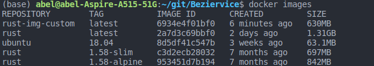

## Justificación de la imagen elegida como base

Existen varias imágenes oficiales de rust para la imagen del contenedor de test, en las cuales es posible elegir la versión de rust. La diferencia entre las imágenes es el tamaño, dado por los paquetes y dependencias que se encuentran en cada imagen y también por la imagen base del sistema operativo.

En estos momentos para los binarios de ejecución se suelen crear imágenes en varios __stage__, donde se toma una imagen base oficial del lenguaje y se compila el programa en ella para luego crear una imagen más pequeña a partir de alguna distribución de tamaño reducido en la que se copia solo el binario generado por la imagen grande. A esto se le suele conocer como build "from scratch". Sin embargo se ha decidido en lugar de crear una imagen propia personalizada intentando logar un resultado de una imagen de tamaño mínimo, dado que el objetivo de este paso del proyecto es familiarizarse con docker y dado que en el comando que se empleará en los tests de entrega se realiza un enlace de los archivos del repositorio con la imagen, he decidido que sería mejor crear una imagen desde 0 en la que se utilice el gestor de tareas y los archivos del proyecto, mejor que una imagen que simplemente contendrá un binario ejecutable y make simplemente lo ejecute.

La imagen base propia presenta el siguiente código:
```Dockerfile
 
FROM ubuntu:18.04

ENV RUSTUP_HOME=/usr/local/rustup \
    CARGO_HOME=/usr/local/cargo \
    PATH=/usr/local/cargo/bin:$PATH \
    RUST_VERSION=1.58.0

RUN apt-get update; \
    apt-get install -y --no-install-recommends \
    ca-certificates \
    gcc \
    libc6-dev \
    wget \
    make \
    ; \
    wget "https://static.rust-lang.org/rustup/archive/1.22.1/x86_64-unknown-linux-gnu/rustup-init"; \
    chmod +x rustup-init; \
    ./rustup-init -y --no-modify-path --profile minimal --default-toolchain $RUST_VERSION --default-host x86_64-unknown-linux-gnu; \
    useradd  berziervice; 
WORKDIR /app/test
CMD chown -R berziervice /app/test && su berziervice -c " PATH=/usr/local/cargo/bin:$PATH make test"
```
En la imagen se pueden ver los tamaños de las imágenes oficiales de rust y de la imagen creada.



En el código se toma un sistema operativo base, se crean las variables de entorno necesarias para rustup y cargo, se instala rustup y finalmente se crea el directorio de trabajo y se da un comando a ejecutar cuando el contenedor se ejecute. Esta imagen generada es, por poco, menor que las imágenes oficiales de rust, por lo que el objetivo ha sido conseguido. Se dispone de una imagen personalizada de Docker para nuestro contenedor de pruebas, con un tamaño mínimo.
