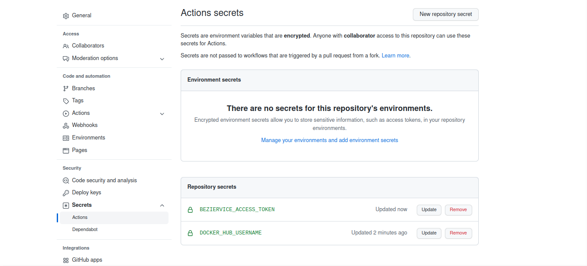

## Dockerhub y actualización automática del contenedor

El primer paso sería crear una cuenta personal en [Dockerhub](https://hub.docker.com/), una vez hecho esto es necesario crear un repositorio, tener un token personal y hacer log in. La documentación de la web es sencilla y completa, indicando incluso los comandos que es necesario copiar para iniciar tu primer repositorio.

Una vez hecho esto, se crea una imagen, con nombre ```<hub-user>/<repo-name>```, con el comando ```docker build -t <hub-user>/<repo-name>[:<tag>]``` y se puede subir como primera vez de forma manual empleando el comando ```docker push <hub-user>/<repo-name>:<tag>```.

Se quiere lograr construir la imagen y subirla a dockerhub cada vez que se haga un commit sobre la rama main, para ello se realizan las siguientes tareas:

1. Comprobar el estado del repositorio
2. Login en dockerhub
3. Construir y subir el contenedor a DockerHub

Para eso se va a seguir la documentación oficial que se encuentra [aquí](https://docs.docker.com/ci-cd/github-actions/#set-up-a-docker-project). Como primer paso se crean los secrets de github con un access token y el username de Dockerhub. Es sencillo en **Settings -> Secrets -> New Repository Secret**, el resultado se puede ver en la imagen. El token solo aparecerá una vez, por lo que es importante hacer login en la CLI de docker si se desea o guardarlo directamente en los secrets de github.



El siguiente paso es hacer que el workflow se triggee cuando sucede un push a la rama main, después crear un trabajo que checkee el repositorio, haga login en Docker Hub y realice la actualización automática. A continuación se ha creado un workflow con el objetivo de cumplir las tareas previamente descritas:

```

name: Dockerhub abeljosesanchez

# Controla cuando va a ejecutarse el workflow
on:
  # Trigger en push a la rama main
  push:
    branches: [ main ]

# Trabajos del workflow
jobs:
  # Un solo trabajo llamado docker
  docker:
    
    runs-on: ubuntu-latest

    # Pasos del trabajo
    steps:
      # Checkea el repositorio
      - name: checkout repo
      - uses: actions/checkout@v3
      # Login a Docker Hub
      - name: Login to Docker Hub
        uses: docker/login-action@v1
        with:
          username: ${{ secrets.DOCKER_HUB_USERNAME }}
          password: ${{ secrets.BEZIERVICE_ACCESS_TOKEN }}
      #Crea y pushea la imagen al repositorio
      - name: Build and push
        uses: docker/build-push-action@v2
        with:
          context: .
          push: true
          tags: ${{ secrets.DOCKER_HUB_USERNAME }}/beziervice
```
